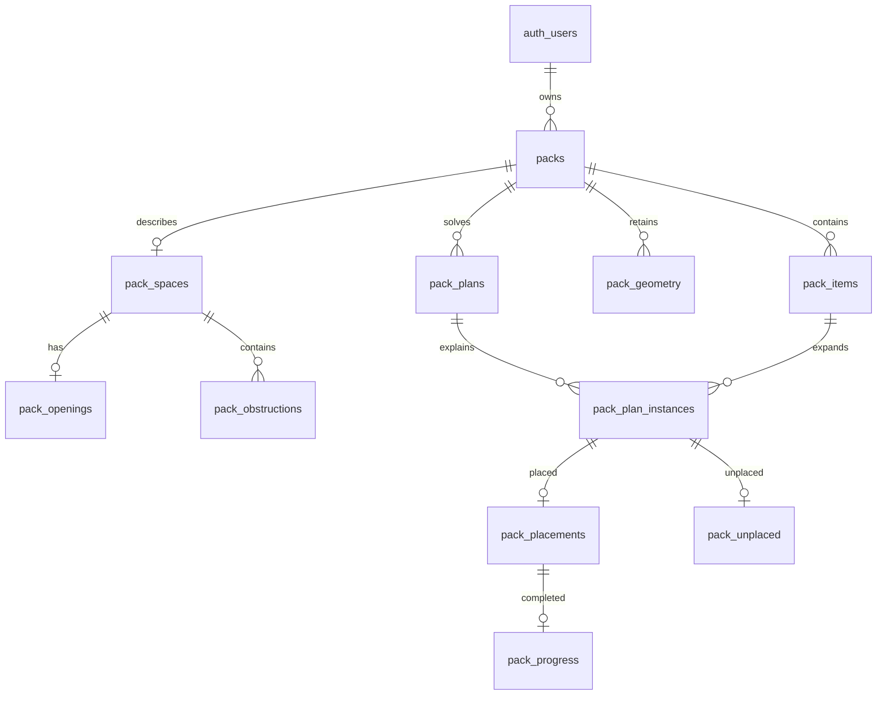

# Pack a Bunch cloud setup

## Product decision

Offline first: Room/SQLite remains the working database for measuring, editing, solving and
following a pack. Supabase Auth requires Google or email/password sign-in before accessing packs. Supabase PostgreSQL is
the intended cloud store; no custom application server is required for ordinary owner-scoped
data access. Account deletion and transactional sync/conflict handling need additional work
before cloud sync ships. Signing in currently does not upload or merge local packs. Authentication is mandatory; offline storage does not mean guest access. The first authenticated account retains pre-account packs; later accounts use separate local databases.

## Requirements and data model

- Each cloud pack has exactly one owner from Supabase-managed auth.users.
- A pack has a space, item specifications, optional openings/obstructions and geometry,
  revision-specific plans, per-instance outcomes and placement-specific guide progress.
- Item quantities expand to instances in each plan; names are not identities.
- Local IDs that are not UUIDs must receive durable cloud UUID mappings during sync.
- Dimensions are integer mm; volumes are bigint; timestamps are server-managed UTC instants.
- Binary grids/masks are versioned geometry artifacts. Cloud geometry payloads contain
  geometry only; opening/obstruction metadata lives in its relational tables. The current
  Room codec bundles these locally and needs a dedicated cloud adapter, not blind copying.
- No photos, raw camera frames, Google tokens or client secrets belong in packing tables.

The logical model follows 3NF: pack ownership is stored once, item names/dimensions live
with item specifications, progress references placements, and outcome details are separate
subtypes. Rendered dimensions are retained in placements as historical orientation-specific
plan output, not as a second editable source for item dimensions. Counts/fill are derived,
not copied into every list row. A persisted plan is usable only if its input revision matches
the current request and PlanValidator accepts it.

## Physical design and limits

Composite foreign keys keep related records in the same pack. RLS and table grants deny
anonymous access and isolate authenticated users. Indexes cover owner/update list queries,
latest plans, item references and parent/child joins. Geometry is bounded at 16 MiB per
artifact to reject unbounded uploads; future larger meshes should use private object storage
with owner-scoped policies. Product quantity limits remain separate from structural limits.

Paginate pack lists by updated_at and id; load item/geometry detail on demand. Measure p95
latency with realistic pack counts and network conditions before setting a production
performance claim. No production load benchmark has been run.

row_version supports compare-and-swap pack updates. **The schema is not a completed sync
protocol:** child writes and parent version changes must be grouped in an atomic RPC before
shipping sync. That RPC must verify the expected version, ownership, full instance coverage,
and complete placed/unplaced details. Concurrent conflicts must preserve both versions or
ask the user. Never silently merge scan grids or overwrite remote edits. A changed input
revision invalidates old plans/ticks; do not use timestamps as the validity check.

Before production, verify the selected Supabase plan's backup retention, make an independent
encrypted export, and rehearse restoring into a separate project. RLS is access control, not
a backup. Free-tier availability/retention is not assumed. Soft deletion uses deleted_at;
purging and account deletion require an explicit retention/deletion workflow.

## Apply and verify

1. Open the SQL Editor in project gxvstomdawaaqezokhfp.
2. Run migrations/202609100001_packing.sql once. It is transactional and does not drop
   existing tables. Inspect any name conflict instead of adding destructive replacements.
3. Verify RLS is enabled on all new tables.
4. Local tests use tests/local_auth_fixture.sql only in a disposable PostgreSQL cluster,
   then the migration and tests/integrity.sql with psql ON_ERROR_STOP=1.
   **Never run the auth fixture in Supabase.**
5. Repeat access tests with two real Supabase test accounts before enabling uploads.

The initial migration was applied through the authenticated Supabase SQL Editor on
2026-09-16 to project gxvstomdawaaqezokhfp. The public schema was empty beforehand.
Post-deployment inspection returned all 11 tables, RLS enabled on each, one ownership
policy per table, and no anonymous SELECT privilege. SQL Editor execution does not add
a Supabase CLI migration-history record; do not blindly reapply the initial migration.
App-to-cloud sync and two-account end-to-end tests are still outstanding. The publishable
key is intentionally unable to perform database administration.

## Google OAuth: exact project setup

The supplied project responds at https://gxvstomdawaaqezokhfp.supabase.co.
Its public auth settings reported Google disabled during this setup.

1. In Google Cloud, use the project containing web client
   770623136334-f2fctsb1odt44d4e6ijmflpv7r38jg75.apps.googleusercontent.com.
   Confirm it still exists: the supplied console notice warned of inactivity deletion.
2. Add this Authorized redirect URI to that Web application client:
   https://gxvstomdawaaqezokhfp.supabase.co/auth/v1/callback
   The localhost/WebContainer entries are web-development settings and do not replace
   Android OAuth registration. Keep entries still used by another app; remove stale ones
   only after confirming they are unused.
3. Create an Android OAuth client in the same Google Cloud project:
   package com.packabunch.debug
   SHA-1 53:3B:5C:28:1E:D6:34:F5:C4:9D:2E:C1:89:88:25:BD:17:06:3E:D3
   SHA-256 04:87:23:62:1A:82:75:A6:5A:68:86:62:7B:97:CA:D6:BA:B3:CD:D1:26:FC:34:F9:97:58:36:90:76:CB:40:3F
4. In Supabase Authentication > Sign In / Providers > Google, enable Google. Put the Web
   client ID first in the client-ID list; include the Android client ID as required by the
   provider configuration. Keep nonce checks enabled.
5. Enter the Google Web client secret directly into Supabase's provider settings. The
   masked suffix is insufficient. If it is unavailable, create a replacement in Google
   yourself and enter it directly into Supabase. Never paste it into source code or chat.
6. Configure consent branding/audience and test users in Google Cloud. Request only
   openid, email and profile. Register the final release package and Play signing certificate
   separately before release; the debug fingerprint is not the Play signing fingerprint.

Native Android sign-in uses Credential Manager and a nonce-bound Google ID token exchanged
with Supabase Auth. It does not send users to localhost and requires no Android callback
intent for this native-token flow. Sessions are encrypted with Android Keystore; no Google
client secret or PostgreSQL password is shipped.

Build settings are in ignored local.properties:
SUPABASE_URL, SUPABASE_PUBLISHABLE_KEY and optional GOOGLE_WEB_CLIENT_ID.
The public URL/key are client configuration, not administrative credentials.

Sources:
- https://supabase.com/docs/guides/auth/social-login/auth-google
- https://supabase.com/docs/guides/database/postgres/row-level-security
- https://developer.android.com/identity/sign-in/credential-manager-siwg-implementation

Verification on 10 September 2026: migration applied successfully to isolated PostgreSQL 18; rollback-only checks passed for invalid dimensions, owner spoofing, child version increments, stale conditional updates, mutually exclusive outcomes, orphan progress, cross-user reads/writes, anonymous access and cascade cleanup. Configured Android assembleDebug passed. Hosted application is pending dashboard sign-in; Google login cannot be verified until its provider/client setup is enabled.

